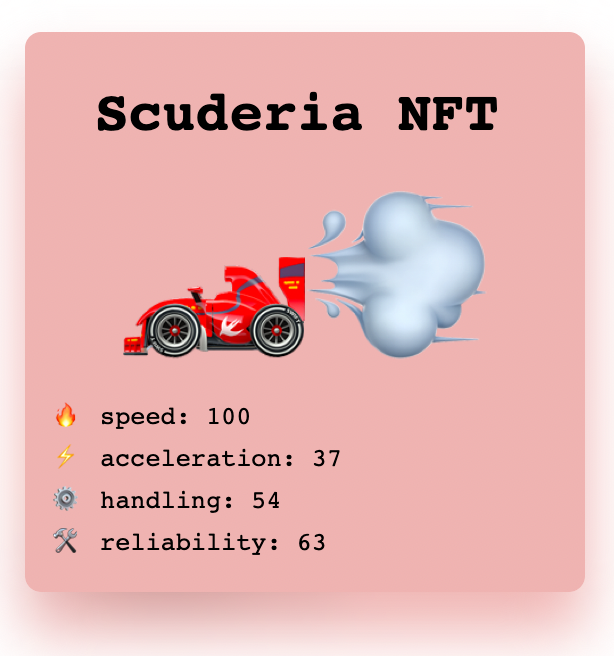
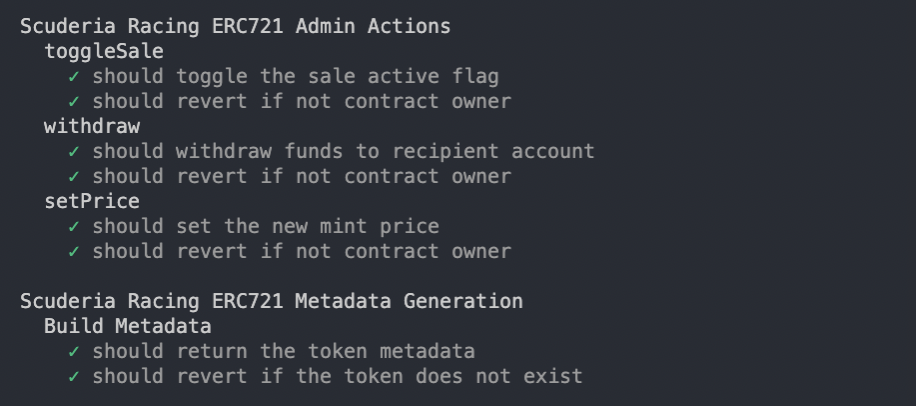

# 

  
  

### 
Ferrari's Formula 1 racing team is called Scuderia Ferrari, with Scuderia translating from Italian as “stable.”
  
  

- 🏎️ Scuderia.sol is the genesis NFT contract for minting your Scuderia Racing NFT. It also enabled self custodial, time-limited staking
  

- 💰 Scoot.sol is the utility token earned by holding Scuderia NFTs. You will earn 10 $SCT per day for each Scuderia token you hold  
  

- 🏁 Racing.sol (still to come) fully on-chain racing contract  
  

   

The goal of this project is to create a fully on-chain racing NFT ecosystem that allows minting, metadata and image generation, racing and betting entirely on-chain. We will aim to keep as much of the project as decentralised as possible, avoiding the need for a database and API as much as possible. Contracts will be deployed to Polygon.

 

NOTE: Feel free to use any of the code in this repository for your own projects. None of the contracts in this repository have been audited, and I take no responsibility for issues which may arise out of their extended use.

## Deployed Contracts

### Polygon Mumbai

*Scuderia.sol*

- `0x52631b00fC363C44E3EbF5cB9188B36c312679A7`
- [Mumbai Polygonscan](https://mumbai.polygonscan.com/address/0x52631b00fC363C44E3EbF5cB9188B36c312679A7)

*Scoot.sol*

- `0xA11D899DDE52F7DEd2bE997da00Cf609a2555326`
- [Mumbai Polygonscan](https://mumbai.polygonscan.com/address/0xA11D899DDE52F7DEd2bE997da00Cf609a2555326)

### Polygon Mainnet

*Scuderia.sol*

- `0x8e7F6848BB252fa68De6cfD3745f7f7C7a0342CF`
- [Polygonscan](https://polygonscan.com/address/0x8e7F6848BB252fa68De6cfD3745f7f7C7a0342CF)

*Scoot.sol*

- `0xA0689b3b8d53613b5E34EC958198D2b5778c9eaF`
- [Polygonscan](https://polygonscan.com/address/0xA0689b3b8d53613b5E34EC958198D2b5778c9eaF)

## Test Coverage

Missing test coverage is on functions which have protective functionality on internal functions which are difficult to test within a hardhat environment

  

  

